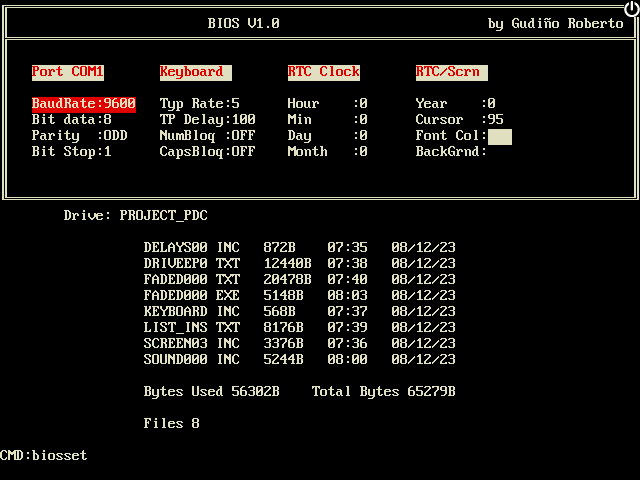

# PDC32-emu

Microinstruction-level emulator for PDC32, a super cool post-apocalyptic computer built from scratch using recycled TTL chips by the awesome [Roberto Gudiño](https://twitter.com/computer_engin)

[You can emulate it from your browser clicking here! (No need to install anything)](https://pdc32.github.io/pdc32-emu/)

How to use the computer?
- [Operating System commands](docs/os_commands.md)
- [ASMPDC instructions](docs/asm_commands.md)
- [Low level ISA (microinstructions)](docs/ISA_PDC32.txt)

## Other resources 
- [Variables used by routines](docs/used_variables.txt)
- [Block diagram](docs/pdc32.drawio.png)
- [Schematics](docs/schematics/)
- [Various videos](https://www.youtube.com/@robertogudino1919)
- [Forum posts](https://www.forosdeelectronica.com/threads/mini-pc-desarrollada-en-l%C3%B3gica-discreta.162081/)
- [Design doc (in Spanish)](docs/PDC32_g.pdf)
- [Schematics (likely outdated)](https://www.forosdeelectronica.com/threads/mini-pc-desarrollada-en-l%C3%B3gica-discreta.162081/page-4#post-1363449)
