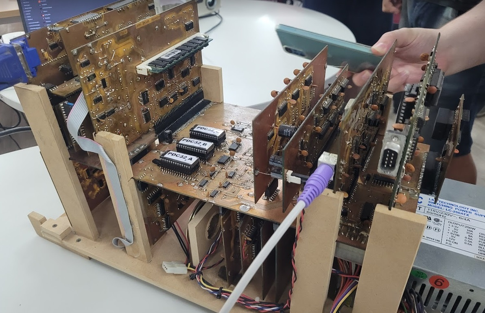
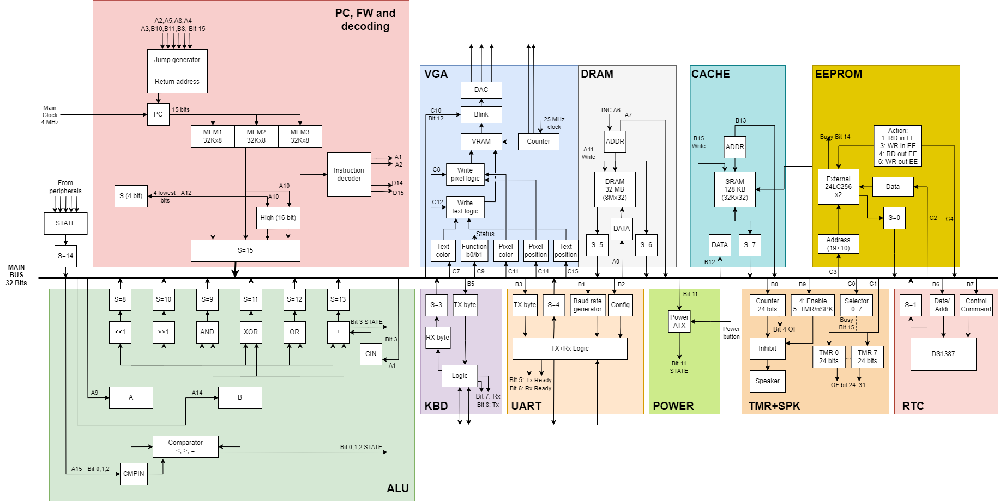

# PDC32-emu

Microinstruction-level emulator for PDC32, a super cool post-apocalyptic computer built from scratch using recycled TTL chips by the awesome [Roberto Gudiño](https://twitter.com/computer_engin)

## Block diagram

## Resources to learn about the arch
- [Various videos](https://www.youtube.com/@robertogudino1919)
- [Forum posts](https://www.forosdeelectronica.com/threads/mini-pc-desarrollada-en-l%C3%B3gica-discreta.162081/)
- [Schematics (may not be complete)](https://www.forosdeelectronica.com/threads/mini-pc-desarrollada-en-l%C3%B3gica-discreta.162081/page-4#post-1363449)
- His own design doc
